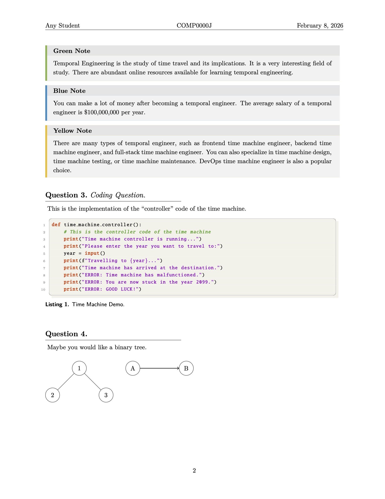
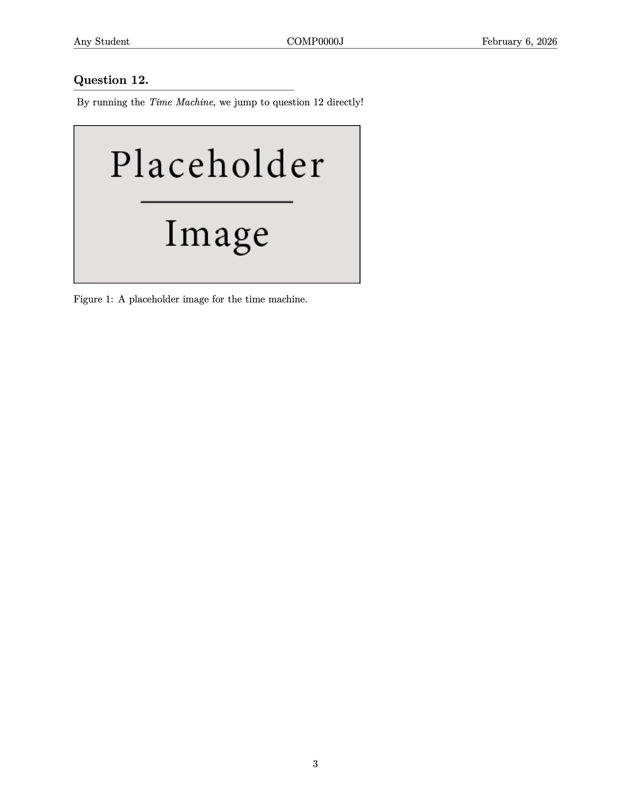

# LaTeX Homework Template

A simple yet elegant LaTeX template for writing your homework. Adapted from [this template](https://github.com/peylix/bdic-report-template-latex).

## Screenshots

<table>
  <tr>
    <td></td>
    <td></td>
    <td></td>
  </tr>
</table>

## Suggestions

1. **Structure:** `main.tex` provides the document structure. By default, content is loaded from `src/questions.tex` via `\input{src/questions}`. You can modify this to include any file you need.
2. **Using this template:** Download **homework-template-release.zip** from the [Releases](https://github.com/peylix/homework-template-latex/releases) page.
   - If you are using Overleaf, go to **New Project > Upload Project** and drag the `.zip` file into the upload window.
   - If you prefer using local editors (e.g., TeXShop, Neovim, VS Code, etc.), unzip the file and open `main.tex` to start editing.
3. **Customization:** The template includes configurable options that are easy to toggle. The `.cls` file features clean, well-structured code that you can customize to suit your needs.
